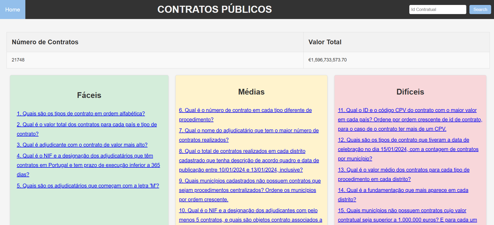
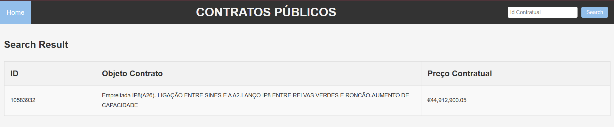
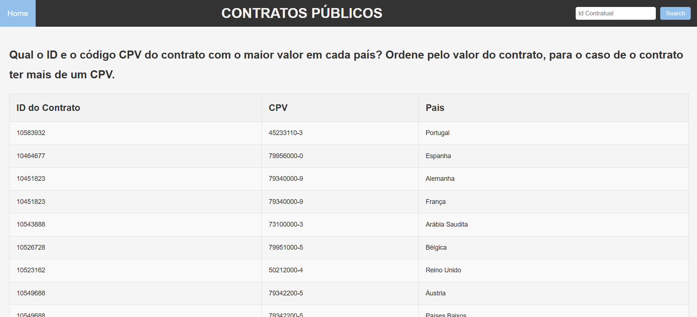

# Public Contracts Database  
This project was developed as part of the **Databases** course in the **Computer Science** and **Artificial Intelligence & Data Science** programs at the Faculty of Sciences, University of Porto. The aim was to model, populate, and interact with a public contracts database, following best practices in modeling and normalization.



## Objective  
The project serves as an opportunity to apply the concepts learned in the course, particularly in the specification of a UML model and its translation into a relational model, as well as the creation, population, and querying of a database using SQL.

## Technologies Used
- **SQLite**: Database used.
- **SQLite3**: Library for interacting with SQLite.
- **OpenPyxl**: For automated data population.
- **Flask**: Framework for creating the web interface.

## Features
### Data Modeling:
- UML Diagrams
- Relational Model

Following the standards of **3rd Normal Form (3NF)**.

### Automated Population:
- Data generated and inserted automatically using Python and the OpenPyxl library.

### SQL Queries:
- 15 queries organized in 3 levels of difficulty.

### Web Interface:
- **Search** public contracts by ID.  
  
- **View** the queries.  
  

## Project Structure
```
/pasta-do-projeto
├── /dataset
│   ├── ContratosPublicos2024.txt     # Informações sobre o dataset
│   └── ContratosPublicos2024.xlsx    # Dataset utilizado     
├── /interface      
│   ├── app.py                        # Aplicação Flask
│   ├── db.py                         # Conexão com a base de dados
│   └── server.py                     # Servidor do projeto
├── /modelagem
│   ├── uml.png                       # Diagrama UML do sistema
│   └── modelo-relacional.png         # Modelo relacional
├── /povoamento
│   ├── schema.sql                    # Script para criar as tabelas
│   └── seed.py                       # Script para popular o banco de dados
├── /queries                          # Codigo das queries utilizadas na interface
│   ├── q1.sql 
|   |   ...   
│   └── q15.sql
|── README.md                         # Este arquivo
└── Relatorio.docx                    # Relatório do projeto
```


## How to Run

### Prerequisites
- Python 3.10 or higher
- SQLite installed

### Steps
1. Clone the repository:
    ```
    git clone https://github.com/belacartaxo/public_contracts_database.git
    cd public_contracts_database
    ```

2. Install the required libraries:
    ```
    pip install openpyxl flask
    ```

3. Create and populate the database:
    - Create the database:
    ```
    python povoamento/schema.py
    ```
    - Populate the database:
    ```
    python povoamento/seed.py
    ```

4. Start the web interface:
    ```
    python interface/server.py
    ```
The application will be available at [http://127.0.0.1:9000](http://127.0.0.1:9000)

## Project Participants - Group G2A
- [Bruno Souza Zabot](https://github.com/bzabot) (up202302069)
- [Guilherme Ferreira Klippel](https://github.com/Klippell) (up202300276)
- [Isabela Britto Cartaxo](https://github.com/belacartaxo) (up202300339)
